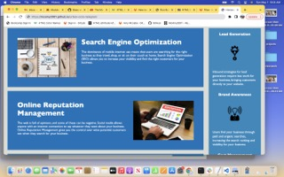

# Challenge, week 1: Refactor starter code

## In this project I was tasked to take starter code for a company website and refactor it for accessibility and search engine optimization.

### To begin I changed several general `div` elements to more specific semantic html elements. These changes required adjusting the css code to reflect the changes from `div class=x` to the html element names. 

### Next, I added `alt` tags to the images on the page where possible. The hero image is part of the css background so an `alt` tag wasn't possible for that image. 

### Finally, I addressed the css code to increase logical flow and efficiency and decrease repetition by combining and reusing class elements wherever possible.

### My refactored site was built using [Git Hub Pages](https://mcamy2001.github.io/urban-octo-telegram/).

  

##### For this class assignment a Table of Contents, Installation Instructions, Usage Information, Credits, License Information, Badges, Features, and Tests are not necessary but I'd like to acknowledge that those would be included here when pertinent.

